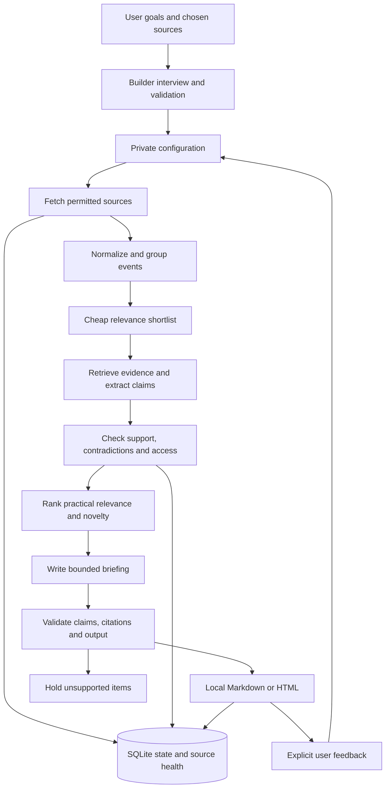

# NewsAgentBuilder: feasibility, research, and implementation plan

Research date: **18 September 2026**. This is a design proposal, not a description of implemented functionality. Platform terms, model availability, and quotas are a dated snapshot.

Detailed companion reports: [Ollama, models, hardware, and local operation](OLLAMA.md) and [ChatGPT subscriptions, third-party clients, and API proxies](SUBSCRIPTION-BACKENDS.md).

## 1. Recommendation

Build a **personal, evidence-backed briefing system that runs on the user's computer**. Its purpose is to help someone decide what deserves attention, what changes their work, and what they can safely postpone.

The idea is feasible with three boundaries:

1. Promise coverage of configured, successfully accessed sources—not every development on the internet.
2. Make local inference the durable zero-paid-API path. Treat subscriptions and free cloud quotas as optional, distinct alternatives.
3. Start with RSS, official announcements, GitHub releases, and selected YouTube channels. Treat closed social networks as individually gated integrations.

The differentiator should be **explainable selection, claim-level evidence, practical relevance, and honest coverage**. Summarization and personalization already exist in other projects. Open source makes the process inspectable; it does not, by itself, make its conclusions correct.

Suggested public description:

> Build a personal briefing from sources you choose. Understand what changed, what the evidence supports, and why it matters to your work. Run it locally with optional model and source integrations.

Avoid promises such as “all AI news,” “no misinformation,” “unbiased,” or “free for everyone with no setup.” Those promises would recreate the trust problem this project wants to solve.

## 2. Refine the product before the architecture

### Who should use the first version?

Start with technical individuals who already use an agent CLI or can install a local model. A universal consumer application would require much more onboarding, support, packaging, and account-integration work.

Use two or three different personas during development: an independent web developer, an ML researcher, and a product designer. If their briefs are almost identical, the personalization is superficial.

Following someone is only one preference signal. A person may follow a creator for entertainment, disagree with them, or use only a small part of their output. Ask for:

- Current responsibilities, recurring tasks, tools, and active projects.
- Decisions they expect to make in the next month or quarter.
- Topics to learn versus changes that require action.
- Technical depth, languages, geography, budget, hardware, and privacy constraints.
- Explicit exclusions, reading-time budget, and tolerance for experimental material.
- A few examples of useful and useless updates, with reasons.

Store these as explicit, editable preferences. Do not infer sensitive characteristics from follows or silently rewrite the profile from reading behavior.

### Personalization must affect the decision

A hypothetical release of a cloud-only design tool could be technically impressive but unsuitable for someone who needs offline processing. A small browser accessibility fix could be more useful to that person than a flagship model launch. The report should say why, referencing a specific profile constraint.

Separate **task impact** from speculation about entire jobs. Prefer “may reduce the time spent on this kind of first draft; worth a small test” to “this will replace designers.” Distinguish the source's prediction from the system's inference.

Following lists should seed the source registry, then the user chooses one of two policies:

- **My sources:** discovery stays within the chosen sources; linked primary evidence may still be retrieved for verification.
- **My sources plus discovery:** a bounded additional search allowance can propose relevant sources and contrasting evidence. New subscriptions require a visible choice.

### A briefing should reduce obligation

Collect daily, but do not force a long daily issue. Suggested starting format:

| Part | Proposed limit | Purpose |
|---|---|---|
| Action needed | 0–2 items | Real deadlines, breaking changes, or directly relevant security notices |
| Worth understanding | 0–3 explainers | Meaningful changes with enough evidence to explain |
| Watch | 0–5 short titles | Promising developments whose practical value remains uncertain |
| Low priority | Collapsed, optional | Low relevance, repeated claims, promotion, or weak evidence |
| Coverage | One short note plus details | Which configured sources were checked and which failed |

These are caps, not targets. “No material changes in the sources checked” is a successful issue. A failed collection run must instead say coverage was incomplete.

Offer a weekly synthesis for slower strategic developments. Avoid streaks, unread counters that accumulate indefinitely, and pressure to clear a backlog. After an absence, generate a bounded catch-up issue.

“Larp” is useful shorthand for the motivation, but a poor classification label. The system generally cannot establish a creator's intent. Use reason codes such as **promotional**, **unsupported performance claim**, **demo only**, **already covered**, **not relevant to this profile**, or **insufficient access**. Low relevance and low credibility are different properties.

## 3. What an agent actually consists of

For this project, distinguish six components:

| Component | Responsibility |
|---|---|
| Model | Classifies, extracts claims, explains, and makes bounded judgments |
| Runtime | Calls the model, executes allowed tools, enforces budgets, and handles failures |
| Tools/connectors | Retrieve feeds, releases, articles, and permitted transcripts |
| Skill | Packages instructions, scripts, examples, and references for an existing runtime |
| State | Remembers sources, evidence, previously covered events, and explicit feedback |
| Scheduler | Starts a run when due and handles missed runs |

A skill is not a model, free compute, or a scheduler. The open Agent Skills format centers on a `SKILL.md` file with optional supporting resources; each host still supplies execution and permissions. [Agent Skills specification and overview](https://agentskills.io/home).

The daily job has a mostly known sequence, so implement it as a **controlled workflow with a few model-driven decisions**. Use an agent loop only where needed—for example, following a claim to an original release note, with a maximum number of searches. Anthropic's workflow/agent distinction is a useful conceptual introduction, although the article explicitly notes that its tooling discussion has aged. [Building effective agents](https://www.anthropic.com/engineering/building-effective-agents).

Do not start with a team of autonomous researcher, critic, editor, and publisher agents. Different roles can be separate prompts or functions in one process. Add orchestration complexity only when an evaluation demonstrates a benefit.

## 4. The builder should configure a shared engine

The “agent that builds a newsletter agent” should initially be an onboarding assistant that produces a validated configuration. Generating a separate executable implementation for every user would create incompatible installations and make bug fixes much harder.

Recommended builder flow:

1. Interview the user and import source URLs or local subscription files.
2. Normalize accounts and URLs; identify the same creator across platforms where explicitly known.
3. Preview what each connector can actually retrieve and what authentication it needs.
4. Produce profile, source, editorial, runtime, and delivery settings.
5. Show a sample issue with explanations of its selections and omissions.
6. Collect corrections, validate configuration, and only then enable a schedule.

The builder can propose settings but should not autonomously install arbitrary packages, execute code from articles, add paid providers, or broaden access permissions.

Proposed configuration bundle:

```text
personal-briefing/
  profile.json       # responsibilities, goals, constraints, preferences
  sources.json       # canonical sources, access modes, collection limits
  editorial.json     # evidence rules, reading budget, discovery policy
  runtime.json       # provider, model, context and spending limits
  schedule.json      # timezone and missed-run behavior
```

These are user-owned private files. Export source lists as OPML where applicable. Package a portable skill as a convenience wrapper around the same engine; do not make host-specific skill behavior the only implementation of important rules.

## 5. Source access: the largest delivery risk

Importing a following list, detecting new posts, retrieving full content, and obtaining rights to process that content are separate problems. A working scraper for one public post does not establish reliable support for all four.

| Source | Practical starting route | Important boundary | Priority |
|---|---|---|---|
| RSS/Atom and official blogs | User URLs, OPML, conditional HTTP requests | Feed entries may be partial; full articles can fail or be restricted | Core |
| GitHub | Explicit repos, releases, changelogs; optional read-only authentication | Stars are interest signals, not evidence of quality; a merged PR is not a shipped feature | Core |
| YouTube | Explicit channel list; subscription import later; metadata-first selection | Transcript access is separate and may fail; visual demos are not fully represented by captions | Early, bounded |
| Reddit | Approved API access where available; permitted user-provided material otherwise | API access requires approval; anonymous or RSS routes are not a durable guarantee | Optional |
| X | User-maintained lists/handles; official API if user accepts cost | Official reads cost money; unofficial access is fragile and permission-sensitive | Optional |
| Instagram | Explicit creator references and permitted imported content | Official API documentation targets professional account management, not a universal personal following feed | Later |
| LinkedIn | Creator websites/newsletters, user-provided content, approved API access | Scraping/browser automation is explicitly restricted by LinkedIn | Later |

GitHub's documented general REST limits are 60 unauthenticated requests per hour and 5,000 for common authenticated usage, with separate search and secondary restrictions. Cache results and avoid polling every repository unnecessarily. [GitHub rate limits](https://docs.github.com/en/rest/using-the-rest-api/rate-limits-for-the-rest-api).

YouTube supports retrieving an authenticated user's subscriptions through `subscriptions.list` with `mine=true`. However, the official caption download method requires permission to edit the video. It is not a general transcript-download API for arbitrary followed channels. Agent Reach's yt-dlp route is a different, best-effort mechanism. [Subscription API](https://developers.google.com/youtube/v3/docs/subscriptions/list), [caption API](https://developers.google.com/youtube/v3/docs/captions/download).

Select promising videos using metadata before attempting full transcripts. Record whether evidence came from creator captions, automatic captions, locally transcribed audio, or only a description. Transcription errors can change product names and benchmark numbers. A caption-only analysis should not claim to have verified a visual demonstration.

Reddit's current policy requires explicit API approval and prohibits circumventing limits. Some third-party README instructions still imply that creating a script app is routine; do not turn that into an onboarding promise. Cookie access is not a substitute for permission. [Reddit Responsible Builder Policy](https://support.reddithelp.com/hc/en-us/articles/42728983564564-Responsible-Builder-Policy).

X currently documents pay-per-use access, including $0.005 per ordinary post read. As an illustration, 1,000 distinct charged post reads each day for 30 days would be **$150**, before other resources or special rates. This makes broad official X ingestion incompatible with a strict zero-cost default. [X pricing](https://docs.x.com/x-api/getting-started/pricing).

Meta's Instagram Login API documentation describes professional-account presence management. It does not establish the universal consumer following-feed import this idea would need. LinkedIn states that third-party scraping and website-automation tools violate its rules. Treat both as product limitations, rather than problems to conceal behind a connector. [Instagram API](https://developers.facebook.com/documentation/instagram-platform/instagram-api-with-instagram-login), [LinkedIn automated activity](https://www.linkedin.com/help/linkedin/answer/a1340567).

Prefer creator-owned websites, feeds, public documentation, and permitted exports. RSS bridges can expand coverage, but they do not create access rights or eliminate upstream failures.

## 6. Agent Reach: useful, but keep it replaceable

[Agent Reach](https://github.com/Panniantong/Agent-Reach) is a useful connector-discovery, setup, and routing layer. Its installed skill directs agents to upstream tools such as GitHub CLI, yt-dlp, feedparser, Jina Reader, and authenticated social backends. The repository is MIT-licensed.

Use it to accelerate experiments and support optional connectors. Keep RSS and GitHub interfaces independently usable so a change in Agent Reach or an upstream CLI does not disable the core product.

It does not establish:

- A reliable universal import of following lists.
- Exhaustive collection or continuing platform permission.
- Editorial truth, user relevance, or a correction mechanism.
- Free model inference or permanently free search/transcription services.

Wrap each backend behind a typed result with `items`, `coverage_status`, `retrieved_at`, `cursor`, and an explicit error category. Never treat a successful process exit as proof of complete content retrieval. An empty response might mean “no updates,” “login expired,” “rate-limited,” or “parser broken.”

Also distinguish local execution from local data processing: a Jina Reader or Exa request uses an external service. A strict local-inference mode can still fetch public websites directly, but should not silently enable external extraction, search, or transcription services.

## 7. Running without paid inference APIs

### Three honest meanings of free

| Mode | Cash cost for inference | Strength | Limitation |
|---|---|---|---|
| Local open-weight model | No provider inference bill | Independence and local processing | Hardware, electricity, speed, installation, and model-quality limits |
| Existing agent subscription | Potentially no additional API bill | Convenient access to a strong model | Subscription/access eligibility and usage caps remain |
| Free cloud quota | Zero while within eligible limits | Works on modest hardware | Account, region, quotas, terms, privacy, and availability can change |
| Optional paid API | Metered | Useful for users who choose it | Must have explicit opt-in and a hard budget |

No option guarantees unlimited frontier-level reasoning, all-platform access, automatic delivery, and zero cost for everyone.

### Local mode: recommended foundation

Use a provider interface and start with Ollama as a practical local runtime. It supports schema-constrained output and can disable cloud features. Valid JSON still needs semantic checks; a schema cannot establish factual correctness. [Ollama structured outputs](https://docs.ollama.com/capabilities/structured-outputs), [local/cloud configuration](https://docs.ollama.com/faq).

Candidate models to benchmark include **Qwen3.5-9B**, **Qwen3.5-27B**, and **gpt-oss-20b**. Their official model documentation establishes availability and permissive Apache-2.0 licensing; it does not prove newsletter accuracy. These are candidates, not a claim that they are the latest or best models. [Qwen 9B](https://huggingface.co/Qwen/Qwen3.5-9B), [Qwen 27B](https://huggingface.co/Qwen/Qwen3.5-27B), [gpt-oss-20b](https://developers.openai.com/api/docs/models/gpt-oss-20b).

Planning estimates for total system/unified memory—not measured compatibility guarantees:

| Hardware class | Starting experiment |
|---|---|
| 8 GB laptop | Small quantized model, short evidence packets, limited volume; offer extractive or user-driven cloud fallback |
| 16 GB laptop | Benchmark a quantized roughly 8–9B model with conservative context; leave memory for the OS |
| 24–32 GB system | Compare a smaller fast model with gpt-oss-20b or a quantized 27B candidate if the actual runtime fits |
| 64 GB+ system | More headroom for larger models/context, still subject to latency and quality tests |

GPU VRAM, unified memory, and ordinary system RAM are not interchangeable. CPU-only execution may be possible but slow. Roughly, dense 9B weights at four bits need 4.5 GB before metadata and runtime overhead; 27B need 13.5 GB. Context caches, vision components, OS memory, and quantization format increase the real requirement. MoE active parameter counts are not the total weights that must be stored.

Do not buy hardware before measuring the workload. Use short per-story evidence packets, process incrementally, and reserve deeper reasoning for the handful of stories likely to matter. Models need current retrieved evidence, not up-to-date training knowledge, to summarize a new release accurately.

### Existing subscriptions: useful personal route

Codex supports ChatGPT sign-in and a non-interactive CLI. A user can use their own supported local installation; availability and usage limits depend on their account. The official documentation specifically warns against using the advanced account-auth CI workflow for public/open-source repositories. Keep personal credentials and runs outside public CI. [Authentication](https://learn.chatgpt.com/docs/auth), [non-interactive use](https://learn.chatgpt.com/docs/non-interactive-mode).

The current official SDK includes Python support, making it a practical second adapter alongside Ollama. OpenCode also documents subscription login; CLIProxyAPI and desktop wrappers provide additional proxy routes with separate operational considerations. The [subscription-backend report](SUBSCRIPTION-BACKENDS.md) distinguishes these instead of treating all third-party use as equivalent. [Official SDK](https://learn.chatgpt.com/docs/codex-sdk).

Claude Code is another possible user-operated host. Its current documentation distinguishes users signing into the unmodified official binary from a third-party product collecting or routing subscription credentials. Do not build an unofficial subscription-token API proxy. A portable skill the user invokes in their own host is the cleaner first experiment. [Claude Code authentication and product conditions](https://code.claude.com/docs/en/legal-and-compliance).

These are optional compatibility paths, not an entitlement to redistribute cloud inference.

### Free cloud tiers: promising, conditional

Gemini CLI documents a Google-account free tier of up to **1,000 model requests per user per day**, subject to service availability and other limits, and supports headless output. A newsletter can consume many model requests; “one digest” is not “one request.” Test it as a user-operated host rather than relying on indefinite free capacity. [Quota documentation](https://geminicli.com/docs/resources/quota-and-pricing/), [headless mode](https://geminicli.com/docs/cli/headless/).

Groq documents a free-plan limit structure with both request and token limits. It is an optional prototype backend, not a capacity guarantee. [Groq limits](https://console.groq.com/docs/rate-limits).

There is a particularly relevant regional nuance for Gemini API: its terms distinguish developer experimentation from making API clients available to users in the EEA, Switzerland, and UK, where they require Paid Services. They also apply Paid Services data-use treatment to unpaid quota in those regions. Therefore “the free tier always trains on your data” and “a free API client can be distributed everywhere” are both oversimplifications. This API rule should not be casually generalized to Gemini CLI's different authentication routes. [Gemini API terms](https://ai.google.dev/gemini-api/terms).

Never silently switch from local to cloud, from one cloud provider to another, or from free quota to paid inference.

## 8. Economics and compute budgets

The actual cost drivers include collection, full-text extraction, search, transcription, model tokens, retries, delivery, and maintenance. Avoid asking the model to rediscover the same sources and reread the same articles every morning.

Illustrative daily workload, explicitly not a benchmark:

| Stage | Assumption | Input tokens |
|---|---|---:|
| Metadata triage | 200 candidates × 250 tokens | 50,000 |
| Evidence extraction | 20 shortlisted items × 2,500 tokens | 50,000 |
| Verification and writing | Bounded additional packets | 30,000 |
| Total | Before extra retries, prompts, and reasoning overhead | 130,000 |

If output totals 12,000 tokens/day, monthly usage is approximately **3.9M input + 0.36M output tokens**. For a paid provider the illustrative model bill is `3.9 × input_price_per_million + 0.36 × output_price_per_million`, plus separately charged tools. Reasoning-token billing varies by provider.

At an illustrative 20 generated tokens/second, 12,000 generated tokens alone take 10 minutes; at 5 tokens/second, 40 minutes. Prompt processing, reasoning, network delays, and transcription add time. Actual hardware benchmarks must replace these assumptions.

Energy can be estimated as `average_incremental_watts × hours_per_day × 30 / 1000` kWh/month. For example, 50 W for one hour/day is 1.5 kWh/month, excluding any additional always-on time. Apply the user's actual tariff rather than advertising a universal monthly cost.

Proposed defaults: maximum fetched items per source, 20 full-text candidates, 3 deep explainers, bounded searches per selected story, one repair attempt for invalid model output, and a wall-clock deadline. Log actual usage and stop cleanly at the budget.

## 9. Existing projects and skills: what is worth reusing?

The following assessment is based on public repository metadata, READMEs, and selected skill files—not a completed security audit or execution benchmark. Recorded repository revisions are in [research-repositories.json](research-repositories.json).

| Project | What it contributes | Fit and qualification |
|---|---|---|
| [Agent Reach](https://github.com/Panniantong/Agent-Reach) | Connector routing and environment diagnosis | MIT; keep as an optional acquisition layer |
| [Tech News Digest](https://github.com/draco-agent/tech-news-digest) | Multi-source collection, deduplication, editorial instructions, validation, delivery templates | MIT; strongest skill to study first for the collection and digest workflow |
| [Holo RSS Reader](https://github.com/helebest/holo-rss-reader) | RSS/Atom, OPML, caching, conditional requests, portable skill packaging | MIT; narrower candidate for feed ingestion |
| [Feed Curator](https://github.com/rizumita/feed-curator) | Personal RSS briefs using a user's Claude Code installation | MIT; close comparison for user-owned personalization |
| [Morning Digest](https://github.com/neelgun17/morning-digest) | Two-stage retrieval, feedback, ranking evaluation | MIT; useful ranking reference, but its service dependencies and email-open tracking do not match this project's default |
| [Newsletter Agent](https://github.com/deev-pal08/Newsletter-Agent) | Profile-driven research, priority levels, history and source health | MIT; close conceptual overlap, but its documented multi-provider stack carries additional dependencies and costs |
| [AI Daily Digest](https://github.com/vigorX777/ai-daily-digest) | Compact RSS-to-ranked-digest skill | No license detected in metadata or root listing; treat as a reference pending licensing clarification |
| [newsagent](https://github.com/druce/newsagent) | Multi-stage selection and editorial pipeline | No license detected in metadata or root listing; also substantially more complex than the proposed first version |

**Tech News Digest deserves a fair reading:** its inspected skill already asks for primary technical evidence on exceptional claims, cross-run deduplication, and validation before delivery. It is not merely a naïve summarizer. Its README also describes engagement and repeated-source signals in scoring, which should not be mistaken for evidence independence. Its social/search layers have optional credentials and costs. Reuse selected ideas or licensed components after inspection; do not assume the whole package meets the zero-cost, personal-relevance, and coverage requirements unchanged. [Actual skill instructions](https://github.com/draco-agent/tech-news-digest/blob/main/SKILL.md).

Holo's documentation exposes configurable network restrictions, but its documented default is permissive. An integration should explicitly choose stricter URL handling. A GitHub Gist should not become a mandatory place to publish a user's private subscriptions. [Holo RSS Reader](https://github.com/helebest/holo-rss-reader).

Feed Curator's README lists several advanced features as roadmap items, including cross-feed deduplication and multi-day story tracking. Treat these as planned, not already delivered. “No API keys” there means the existing agent supplies the model, not that inference has no underlying cost. [Feed Curator](https://github.com/rizumita/feed-curator).

[FreshRSS](https://github.com/FreshRSS/FreshRSS) is a useful plain-reader baseline, and [RSSHub](https://github.com/DIYgod/RSSHub) is a possible optional feed bridge. Both repositories currently identify AGPL-3.0 licensing; do not casually copy their code into a permissively licensed core. Connecting to a separately operated service and incorporating code are different integration choices.

No reviewed project demonstrated the complete intended combination under test: portable personal setup, the six named social/source families, no paid API requirement, claim-level support, explicit access failures, and job-specific decisions. That is a bounded observation about this review, not a claim that no such project exists anywhere.

### Installation recommendation

Do not install a large skill bundle to begin. Agent Reach is already available in the research environment. Next, inspect and pin one digest or RSS skill in an isolated development environment, disable delivery, and compare its output against a manually curated issue. Skills can include executable code and broad operational instructions; popularity is not an audit.

For code reuse, preserve license notices and record upstream versions. A public GitHub repository without a license is not automatically permission to redistribute modified code. [GitHub licensing guidance](https://docs.github.com/en/repositories/managing-your-repositorys-settings-and-features/customizing-your-repository/licensing-a-repository).

## 10. Recommended technical architecture

Use a small Python CLI, SQLite, explicit schemas, and static Markdown/HTML output. This fits a locally run data-processing tool and avoids introducing a frontend framework or build step. A few narrowly justified dependencies are preferable to reimplementing robust feed parsing and article extraction.

Proposed components: a feed parser, HTTP client, article-text extractor, and schema validator. Python's standard library supplies SQLite and basic CLI/scheduling integration. Select and pin exact packages during implementation after license and maintenance checks. No new dependencies were installed for this report.



A model adapter should expose tasks such as `extract_claims`, `classify_relevance`, and `write_explainer`. It should report provider, actual model identity when available, tokens, latency, and failure category. Keep CLI-host integration separate from ordinary HTTP model APIs; their authentication, tool permissions, output envelopes, and quotas differ.

A source adapter should expose capabilities separately: `import_subscriptions`, `list_new_items`, `fetch_content`, and optionally `fetch_replies`. Unsupported capabilities should be explicit.

### State and provenance

Use ordinary SQLite tables initially: profiles, sources, fetch runs, source items, events, claims, evidence, claim-evidence links, decisions, digest items, and feedback. Full-text search and simple similarity can precede any vector database.

Every source item needs a platform ID or canonical URL, source and author, publication/update/retrieval timestamps, content hash, access method, completeness, and content language. Preserve the distinction between a new publication and an old page that was just fetched.

An event groups related reports. A claim is an assertion extracted from them. Evidence links point to actual passages or transcript timestamps, with a relationship such as supports, contradicts, or insufficient. Keep source-family information so copied reporting is not counted as independent confirmation.

Remember what was **told to the user**, not merely what was fetched. The same event should reappear only when there is a meaningful change: public access, new pricing, an independent evaluation, a correction, or a relevant limitation.

Persist validated checkpoints. Use a run lock, idempotent delivery key, bounded retries, and a source cursor so retries cannot resend the same edition or lose partially completed collection. Expire content according to the connector's requirements and the user's retention settings; do not assume indefinite full-text archival is acceptable.

### Scheduling and delivery

For the first release, use the operating system's scheduler and a local output directory. On a sleeping or powered-off machine, the briefing may not run on time; design a “run once after wake/start” catch-up policy with deduplication.

Support optional email through the user's chosen account later. Keep email credentials out of the model process, show the delivery destination during setup, disable tracking pixels, and sanitize rendered content. A private local page needs no external fonts, scripts, or analytics.

Use public GitHub Actions primarily for code checks and synthetic/public test fixtures. They are not a dependable personal scheduler: GitHub documents possible delays, dropped scheduled jobs under load, and disabling schedules after 60 days of inactivity in public repositories. Public CI also creates risks for private profiles, content, and logs. [GitHub scheduling documentation](https://docs.github.com/en/actions/reference/workflows-and-actions/events-that-trigger-workflows#schedule).

An always-on home machine or user-managed server can be a later option. Hosting the source code publicly does not require publishing anyone's daily issues or operating a shared service.

## 11. Editorial verification is the core feature

### The unit of verification is the claim

Suppose five creators say that a model is “twice as good.” The worker should find the original comparison, determine the task, baseline, metric, testing conditions, and who performed it. Five reposts of the same vendor chart remain one underlying evidence source.

A release note can establish that a feature was announced or shipped. It usually cannot independently establish that the feature outperforms competitors. Similarly, “open weights” does not automatically establish open training data, reproducibility, permissive downstream rights, or low local hardware requirements.

Use evidence labels such as:

- **Documented:** directly supported by a relevant primary source.
- **Independently tested:** supported by an identifiable independent evaluation with methods.
- **Attributed claim:** a vendor or creator asserts it; validation is limited.
- **Conflicting:** materially inconsistent evidence remains unresolved.
- **Insufficient evidence:** available material does not support the conclusion.

The labels apply to specific claims, not entire creators. Avoid a fake “97% confidence” score unless it has actually been calibrated. An independent source is useful where the claim warrants it, not a mandatory second citation for every straightforward release date.

### Verification gates

Before a factual claim appears in the main brief:

1. Its cited source must have been retrieved, with the access level recorded.
2. The referenced passage must support the assertion and its scope.
3. Names, dates, units, versions, and availability must agree with the source.
4. The system must separate source fact, source claim, editorial inference, and proposed action.
5. Known contradictions and relevant limitations must be retained.

Deterministic validation can check that a cited passage exists and a version string matches. Entailment and contextual interpretation still need model evaluation and human spot checks. A second pass by the same model may catch errors but is not independent corroboration. Multiple models can also share the same error.

If an essential claim fails verification, downgrade or omit it. A high-impact unverified development can remain in Watch with its uncertainty; it should not be silently declared false. Confirmed corrections should be linked to the previous issue and surfaced prominently.

### Practical relevance scoring

Start with an interpretable rubric instead of an opaque model score. One proposed internal ordering rule is:

`priority = 3 × task_fit + 2 × likely_impact + 2 × actionability + novelty − adoption_friction`

Each dimension can initially use a short 0–4 rubric. These weights are hypotheses to tune with user judgments, not established science. Apply an evidence gate separately, and use urgency as a routing rule for genuine deadlines rather than letting an unsupported sensational story win by a large impact score.

For every selected item, store: matching profile goal, what is new relative to prior coverage, evidence state, practical limitation, and recommended response. Common responses should include **use now**, **test briefly**, **understand**, **watch**, and **no action**.

Do not optimize for clicks, popularity, or how many tools someone tries. Optimize for useful decisions within their reading budget. Keep an optional small discovery allowance to reduce tunnel vision, with clear separation from the user's core interests.

### Example item format

The following is deliberately hypothetical, not a news claim:

> **A tool you use adds local processing — test briefly.**
>
> **What changed:** its release documentation says a previously cloud-only task can now run locally.
>
> **Evidence:** the release and installation instructions support availability; performance claims remain vendor-reported.
>
> **Why it matters:** local processing matches your stated privacy constraint for client material.
>
> **Limitations:** hardware fit and output quality have not been tested on your workflow.
>
> **Next step:** try one public sample task before changing your production setup.
>
> **Sources:** exact release version and relevant documentation passages would be linked here.

Detailed explanations should be layered: a short decision summary first, expandable technical context and evidence after it. This accommodates both a five-minute read and an occasional deeper investigation.

## 12. Security, privacy, and content boundaries

This product reads arbitrary content and may have authenticated tools. Its most relevant threat is an article, README, comment, or transcript containing instructions intended to redirect the agent.

Treat retrieved text as untrusted data. Prompt wording alone is insufficient. Keep the writer/verifier unable to read credentials, execute arbitrary shell commands, send messages, or change configuration. Use allowlisted tool operations, arguments validated in code, and a separate delivery process.

Recommended defaults:

- Secrets in the OS credential store or restricted local configuration, never prompts, Git, or diagnostic logs.
- No automatic discovery or export of browser cookies. Social sessions remain explicitly user-controlled.
- Public-URL fetchers reject private-network targets and recheck redirects, DNS resolution, response size, and content type.
- Escape HTML and disallow executable content in articles and generated briefings.
- Local model service bound to loopback; no unnecessary public listener.
- Private profiles and issues stored outside the source repository by default.
- Clear controls to export/delete history, remove sources, and reset learned preferences.
- No silent network-provider fallback or background installation of new skills.

Data minimization also improves quality: the model rarely needs a full person's social graph or all their private messages to rank a public release. Use only the profile fields relevant to the editorial task.

Keep the project's code license separate from rights in retrieved material. Link and summarize; do not publish a mirrored corpus of full articles or transcripts by default. Respect platform access, retention, and deletion requirements. Local processing reduces disclosure but does not automatically establish legal compliance. A future public redistribution feature would need its own review.

## 13. Evaluation: prove that it is useful

Before polishing onboarding, create a manually labeled benchmark with roughly **100–200 items grouped into events**, across several dates and at least three user profiles. Include ordinary updates and adversarial cases. These are proposed evaluation sizes, not existing results.

Essential cases:

- Several posts repeat one announcement; only one event should appear.
- An old launch is presented as new.
- A preview, waitlist, or merged PR is described as generally available.
- A benchmark comparison omits a crucial condition.
- A source contradicts a headline or later corrects itself.
- A transcript is missing, incomplete, or corrupts a number.
- A low-engagement change matters to the user's actual tools.
- A popular development does not fit the user's constraints.
- The evidence contains a prompt-injection attempt.
- An entire source fails; the issue must disclose the gap.
- Nothing important happens; the issue must stay short.

Compare against three baselines: chronological RSS, a single summarization prompt, and a simple keyword/rule-based ranker. Without these comparisons, a complex agent may merely look sophisticated.

| Metric | What it tells you |
|---|---|
| Precision among the top items | How much of the main brief the user actually found useful |
| Recall of important labeled events | Whether filtering hides things the user needed to know |
| Claim support and citation correctness | Whether text is grounded in the retrieved evidence |
| Unsupported consequential claims | Whether an invented fact could affect a decision |
| Repetition rate | Whether coverage is new rather than repeated commentary |
| Uncertainty/abstention behavior | Whether the system recognizes insufficient evidence |
| Source coverage and failure disclosure | Whether collection failures are visible |
| Runtime, tokens, memory, maintenance | Whether the promised operating mode is practical |
| Time saved and perceived FOMO | Whether the product solves the original problem |

Suggested pilot gates: at least 80% user-rated usefulness among the main items, at least 90% recall for the benchmark's explicitly labeled must-know events, complete valid source references for factual explainers, and no observed unsupported consequential claims. These are starting acceptance targets, not performance claims; report denominators and uncertainty, especially on small samples.

Use human review for important judgments. Model-based graders can assist but should not be the sole truth oracle. Keep a held-out chronological slice so prompt tuning does not simply memorize the evaluation cases. Record model, quantization, prompts, profile, and connector versions for reproducibility. [Agent evaluation principles](https://www.anthropic.com/engineering/demystifying-evals-for-ai-agents).

Measure omitted content too. Sample low-priority items and ask whether something valuable was suppressed. Optimizing only the visible stories can reward an overcautious system that misses every emerging development.

Feedback should be explicit and minimal: useful, already knew, wrong relevance, unsupported, too basic, too detailed, or go deeper. Do not make email-open tracking the measure of success.

## 14. Phased implementation plan

Effort ranges below are planning estimates for one developer, not delivery commitments. Platform approval delays and broad OS support can dominate elapsed time.

| Phase | Deliverable | Approximate effort | Exit condition |
|---|---|---|---|
| 1. Editorial experiment | A manually checked brief from 10–20 curated sources; two or three profiles | 3–5 focused days plus daily observation | A reader can explain why this is better than their current feed |
| 2. Reproducible local worker | RSS + GitHub, SQLite, deduplication, one local model adapter, citations, local output | 1–2 weeks | Repeated runs are stable, bounded, private, and visibly handle failures |
| 3. Quality and personalization | Evidence ledger, delta tracking, rubrics, feedback, held-out benchmark | 1–2 weeks | Passes agreed quality gates and beats simple baselines |
| 4. Builder and packaging | Interview, config validation, preview, source import, doctor command, schedule setup | 1–2 weeks | A new technical user can obtain a useful issue without editing code |
| 5. Optional integrations | YouTube expansion, approved social connectors, email, optional cloud hosts | Ongoing | Each connector earns a documented support level through tests |

The first useful personal prototype can precede most of this work. A maintainable public release is a larger commitment. Keep the first pilot running for roughly two weeks before drawing conclusions from a few impressive samples.

For the first vertical slice, implement only:

1. Import a curated source list and explicit profile.
2. Fetch RSS and GitHub release information incrementally.
3. Group events and create a small shortlist.
4. Retrieve evidence, produce three or fewer cited explainers, and flag uncertainty.
5. Render local Markdown and a small static HTML page.
6. Save history, coverage, and user corrections.

Delay automatic social-graph import, a browser extension, public email distribution, a mobile app, model fine-tuning, and a multi-agent framework. None is needed to prove the editorial value.

## 15. Open-source project strategy

Keep the public repository focused on engine code, schemas, portable skills, tests, synthetic fixtures, documentation, and opt-in source packs. Keep every actual user's profile, credentials, collected material, feedback, and daily output private.

Suggested eventual repository layout:

```text
src/newsagentbuilder/
  builder/
  connectors/
  pipeline/
  models/
  storage/
  render/
skills/newsagent-builder/
skills/newsagent-runner/
schemas/
source-packs/
tests/fixtures/
evals/
docs/
```

Source packs should declare their scope, selection rationale, owner, last validation date, and required access mode. Provide a small general pack, then optional role-specific packs. Do not silently subscribe everyone to hundreds of sources.

Publish a connector capability matrix with states such as supported, experimental, manual import, and unavailable. Specify content limitations—not just a green “connected” icon. Contributors should provide contract tests, error behavior, retention considerations, and access documentation for new connectors.

Choose an explicit code license before calling the release fully open source. MIT is a simple option for broad reuse; choose copyleft deliberately if reciprocal publication is a project goal. Being non-SaaS yourself does not prevent others from commercializing permissively licensed code. The repository inspected for this research did not yet contain a license file. [Licensing guidance](https://docs.github.com/en/repositories/managing-your-repositorys-settings-and-features/customizing-your-repository/licensing-a-repository).

Useful public documents include a threat model, data-flow explanation, contribution guide, support policy, and reproducible evaluation instructions. Keep no-telemetry behavior the default. Optional sponsorship can fund maintenance without charging users for a hosted newsletter, but the project should not depend on funding to run locally.

The biggest ongoing burden will likely be connector maintenance and user environments, not writing summaries. Limiting guaranteed integrations is a quality decision. Avoid promising a fixed delivery time on arbitrary sleeping laptops or guaranteeing access to platforms you do not control.

## 16. Risks, decisions, and next steps

| Risk | Likely consequence | Proposed response |
|---|---|---|
| Social connector breaks | Missing coverage or repeated login work | Stable feed core; explicit connector health; manual alternatives |
| Plausible unsupported writing | Trust damage | Claim-level evidence, bounded output, abstention, human evaluation |
| Aggressive noise filtering | Important developments disappear | Evaluate recall; sample discarded items; preserve Watch |
| Personalized echo chamber | Missed contrary evidence | Small opt-in discovery allowance and provenance-aware verification |
| Weak local hardware | Slow runs or inadequate interpretation | Smaller workload, hardware-tier benchmarks, extractive fallback |
| Cloud quota or terms change | Unexpected failure/cost | Provider independence, no silent paid fallback |
| Builder generates arbitrary code | Fragile and unsafe per-user agents | Schema-validated configurations over a shared engine |
| Newsletter recreates FOMO | More obligations and tool chasing | Reading budget, no-action outcomes, optional short issues |

Decisions worth making before implementation are the initial audience, target hardware tier, strictness of the zero-cost requirement, discovery policy, output channel, and code license. The recommended defaults are technical individual users, ordinary modern laptops, a real local mode, opt-in discovery, local HTML/Markdown, and a permissive license after explicit selection.

**The next concrete experiment:** take the same week of source material, produce a plain feed, a single-prompt summary, and an evidence-based personalized brief. Have readers score usefulness and missed important events without knowing which method produced which. Build out the agent builder only after the personalized brief shows a clear advantage.

## 17. Research scope and limitations

This research used Agent Reach's GitHub CLI and Exa routes, its local capability diagnosis, official provider/platform documentation, and a Jina Reader fallback for Meta documentation after direct retrieval was rate-limited. Repository metadata, README files, and selected skill instructions were inspected; public revision identifiers were recorded separately. Agent Reach's update check reported v1.5.0 current at research time.

No social accounts were connected, no following lists were imported, no new skills or model weights were installed, and no newsletter was sent. Connector reliability, local model quality, latency, and suggested evaluation thresholds remain to be tested. No comprehensive security audit of the referenced repositories was performed. GitHub activity and README claims were used for discovery and assessment, not as proof of production readiness.

The architecture, scoring rubric, budget scenarios, acceptance targets, and effort estimates are recommendations from this analysis. Official documentation supports the cited capability and policy facts; it does not validate the proposed product's future performance.
